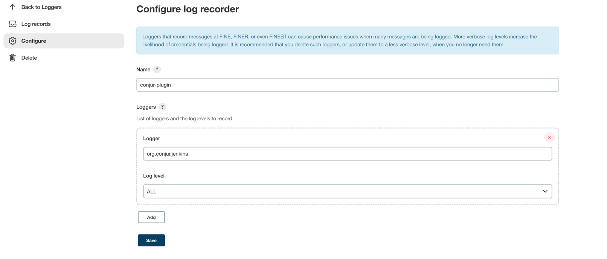

# Demo project for Conjur integration with Jenkins

## Pre-requisites
- OS Linux / MacOS
- conjur-cloud-cli

## Azure Setup

- Declare Jenkins authenticator
```shell
./load-authenticator.sh
```

- Declare Your Apps
```shell
./load-hosts.sh
```

